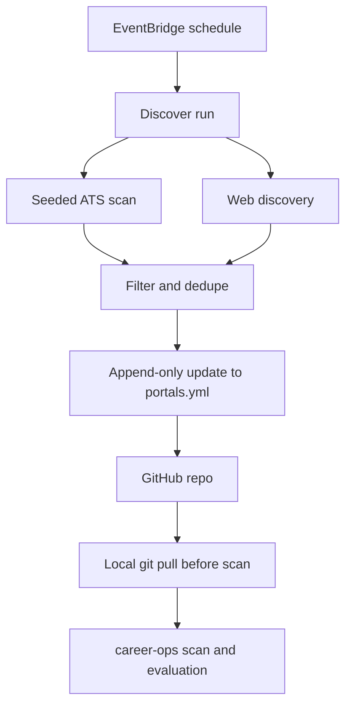

# Job Discovery System Architecture

## Problem Frame

`career-ops` can evaluate and track roles well once a company is known, but it does not expand the search universe on its own. The gap is a low-cost, always-on discovery layer that can find new relevant companies and feed them into the existing `career-ops` workflow without requiring the local machine to stay on or forcing a second source of truth.

The architecture should preserve a clean ownership boundary: discovery is responsible for finding and proposing new portal entries; `career-ops` remains responsible for scanning, evaluation, document generation, and tracker updates.

## Requirements

**Contract and Ownership**
- R1. `portals.yml` in the `career-ops` repository must remain the single integration contract between discovery and `career-ops`.
- R2. The discovery system must be additive-only with respect to `portals.yml`: it may append new entries but must not mutate, remove, or restructure existing entries owned by `career-ops` or the user.
- R3. Every appended entry must include stable identity fields sufficient for future deduplication and scanning, including a canonical company identity, ATS/provider type when applicable, and the canonical portal URL.
- R4. Every appended entry must include, at minimum, `company_slug`, `company_name`, `source_type`, `portal_url`, `entry_kind`, `discovered_at`, `discovery_source`, and `match_reason`.
- R5. Entries discovered from credible non-ATS hiring pages must be explicitly distinguishable from normal ATS-backed scan targets so `career-ops` can route them through a separate lead-review path.

**Discovery Behavior**
- R6. The discovery layer must run on a schedule without depending on the user's local machine being online.
- R7. The system must support two complementary discovery paths: scanning known ATS portals from a curated seed list, and expanding the candidate set via web search into companies not already tracked.
- R8. Web discovery results may be promoted into `portals.yml` when they resolve either to a public ATS endpoint or to a credible public non-ATS hiring page on the company domain or a clearly company-controlled subdomain or microsite, and that page exposes at least one relevant live opening fetched during the current run.
- R9. Hard filters must be applied before any write, including role relevance and geographic fit, with filter criteria centrally configurable rather than hard-coded in source.
- R10. Discovery queries must be generated from a structured discovery profile rather than from raw CV text or unstructured biography.
- R11. The discovery profile must support role keywords, exclusions, location constraints, company preferences, product-surface preferences, end-to-end ownership preference, and preferred tech stack signals.
- R12. A live matching role must be proven by a currently visible job posting fetched successfully during the current run, and the posting title must pass the configured keyword rules rather than semantic similarity alone.
- R13. Soft scoring must prioritize end-to-end ownership signals first and tech stack fit second when ranking otherwise-eligible candidates.

**Safety and Idempotency**
- R14. Each run must deduplicate against both the current `portals.yml` contents and a historical seen cache before writing.
- R15. The seen cache must key entries by canonical `company_slug` only, and cache membership must survive ATS provider changes, portal URL changes, and ordinary file edits until you manually clear it.
- R16. The write path must be idempotent: rerunning the same inputs must not produce duplicate entries or noisy file diffs.
- R17. The GitHub write flow must handle concurrent file changes safely by refetching and retrying merge-on-write or aborting cleanly without corrupting `portals.yml`.
- R18. Output serialization and entry ordering should be deterministic so repository diffs remain small and understandable.
- R19. Failures in one source pipeline must not prevent successful candidates from other sources from being processed, and partial failures must be visible in logs.

**Operations and Integration**
- R20. `career-ops` local scan mode must pull the latest repository state before reading `portals.yml`.
- R21. `career-ops` must treat non-ATS entries as leads that require a separate or manual review path rather than as normal scan targets.
- R22. Secrets for external services must be stored outside source control and retrieved at runtime.
- R23. The system must emit invocation-level logs that explain how many candidates were found, filtered, appended, skipped as duplicates, and failed due to source errors.
- R24. The initial system should stay within effectively zero-to-negligible monthly operating cost and avoid stateful infrastructure that is unnecessary for the first version.

## Success Criteria
- New relevant companies appear in `portals.yml` within one scheduler interval of being discoverable from supported public sources.
- Running discovery repeatedly against unchanged upstream data produces no duplicate entries and no unnecessary GitHub commits.
- A local `/career-ops scan` session picks up new discoveries with a `git pull` and no other manual sync step.
- When a discovery source fails or returns noisy results, logs make the reason visible without requiring manual forensic work.

## Scope Boundaries
- No automatic application submission.
- No authenticated scraping, LinkedIn scraping, or login-wall scraping.
- No job-quality evaluation beyond discovery-time relevance filters and coarse ranking.
- No notifications in the first version; discovery is consumed during normal `career-ops` scan sessions.
- No second operational database for canonical job tracking in v1 unless planning proves the file-contract model cannot satisfy R10-R13.

## Key Decisions
- Single shared contract: `portals.yml` is the only integration point because it keeps discovery decoupled from `career-ops` internals.
- Append-only writer: discovery should add new entries and stop there, leaving ownership of evaluation and lifecycle decisions to `career-ops`.
- Canonical identity: deduplication should use one stable slug per hiring brand, folding aliases, rebrands, and multiple portals into that identity. Subsidiaries should only get separate identities when they recruit as clearly separate brands.
- Rejection semantics: if a company is intentionally removed or rejected, discovery should treat it as permanently suppressed until manually unblocked.
- Suppression lifecycle: the system should support `active`, `snoozed`, `re-review`, and `suppressed` states. `Re-review` is time-based reconsideration only; discovery must not auto-write the company again until you explicitly clear it.
- Snooze behavior: `snoozed` should block rediscovery for a fixed period and then automatically return the company to `active`.
- Re-review entry: a company should enter `re-review` only through an explicit manual action by you.
- Unblock authority: only you may manually clear `re-review` or `suppressed` states; discovery must never auto-unblock them.
- Manual deletion semantics: deleting a company from `portals.yml` should be treated as a suppression action, and discovery must not re-add it unless you manually unblock it.
- Minimum entry schema: v1 should use an operational contract with `company_slug`, `company_name`, `source_type`, `portal_url`, `entry_kind`, `discovered_at`, `discovery_source`, and `match_reason` as baseline fields.
- Seen-cache keying: historical suppression and deduplication should key on canonical `company_slug` only, not provider or portal URL, and should survive provider churn until you manually clear the cache.
- Structured query input: discovery should send a compact preference profile to Brave and Exa, not raw CV text or personal biography.
- Live-role proof: discovery may only write after fetching a currently visible posting in the same run and confirming the title through configured keyword rules; semantic search can suggest companies but cannot by itself justify a write.
- Non-ATS credibility: non-ATS writes are allowed only from the company domain or a clearly company-controlled subdomain or microsite, and only when the run fetched a directly visible relevant posting from that page.
- Ranking priority: soft scoring should favor end-to-end ownership signals first, then tech stack fit, with product-surface fit as an additional but lower-order signal.
- Source breadth over purity: v1 should allow credible non-ATS hiring pages to be written directly instead of requiring ATS verification first.
- Lead routing for non-ATS: credible non-ATS pages should share the same file contract but be explicitly marked so `career-ops` handles them through a separate lead-review path.
- Public ATS-first discovery: the system should prefer public Greenhouse, Ashby, and Lever style sources because they are stable, machine-readable, and aligned with the existing scan model.
- Low-ceremony state: a small object-store seen cache is the right initial persistence choice because the system only needs coarse historical suppression, not rich queries.
- Direct repo updates over review queue: the initial version should write directly to the repository rather than opening PRs, but only with idempotent merge-on-write safeguards.

## Dependencies / Assumptions
- `career-ops` can already consume portal entries as long as they match the expected `portals.yml` shape.
- The repository has a stable enough `portals.yml` schema to extend with new entries without human cleanup after every run.
- Brave and Exa quotas remain sufficient for low-volume scheduled use.
- GitHub token, Brave API key, and Exa API key are available at runtime.

## Outstanding Questions

### Deferred to Planning
- [Affects R4][Needs research] How should the chosen operational fields be represented in the existing `portals.yml` structure without breaking current `career-ops` readers?
- [Affects R4][Needs research] If one of the operational metadata fields is temporarily unavailable, should the write fail or should a narrower fallback write be allowed?
- [Affects R5, R20][Technical] What is the smallest schema addition that clearly marks non-ATS lead entries without complicating existing `career-ops` readers?
- [Affects R7, R9, R13][Needs research] How should hard-filter precedence work when company preferences or soft scoring strongly favor a company but geographic or title filters are weak or ambiguous?
- [Affects R8, R14][Technical] Should deduplication occur strictly at company level, or should any secondary portal-level or market-level keys exist for edge cases such as multiple country portals?
- [Affects R8, R17][Technical] If both ATS and non-ATS signals exist for one company, which source should win for the canonical entry and can both be preserved without creating duplicate logical companies?
- [Affects R7][Operational] How is the seed list curated over time, who owns updates, and are stale seeds ever retired?
- [Affects R17][Technical] What retry policy and backoff should the GitHub writer use when the file SHA changes mid-write?
- [Affects R7, R8, R17][Technical] What retry boundaries should differ across source fetch, source parse, scoring, cache read, GitHub read, and GitHub write?
- [Affects R7, R8][Needs research] How reliably can location and remote eligibility be inferred across Greenhouse, Ashby, Lever, and search-discovered company pages without introducing too many false positives?
- [Affects R9][Needs research] How should geographic fit handle remote-anywhere, remote-in-region, visa sponsorship, relocation, multi-location listings, and vague regional language such as EMEA?
- [Affects R18][Technical] Should deterministic ordering preserve historical append order, sort by score within a run, or sort by canonical company identity to minimize future diff churn?
- [Affects R16, R18][Technical] What exact condition should trigger a Git commit: only net-new logical entries, or also metadata-only enrichments if those are later permitted?
- [Affects R16, R19, R23][Operational] When search-provider quota is exhausted or one provider partially fails, what degraded guarantees are still acceptable for a run to count as successful?
- [Affects R19, R23][Operational] What decision-level observability is needed so false negatives and false positives can be debugged without replaying the entire run?
- [Affects R16, R17, R23][Operational] Should v1 include a dry-run mode for rollout and validation before enabling direct repo writes?
- [Affects R7][Operational] What fetch etiquette and crawl guardrails apply to non-ATS pages, including robots handling, rate limits, and retry behavior?
- [Affects R6][Operational] What exact scheduler interval should be treated as the product default for success criteria and quota planning?
- [Affects R16, R18][Technical] How should the system avoid empty or low-signal commits when formatting changes but no logical additions occurred?
- [Affects R24][Operational] What monthly cost ceiling should count as acceptable for v1 so later tradeoffs can be judged objectively?
- [Affects R1, R3, R4][Technical] How should future `portals.yml` schema evolution be coordinated so discovery and `career-ops` do not silently diverge?

## Next Steps

-> `/ce-plan` for structured implementation planning
