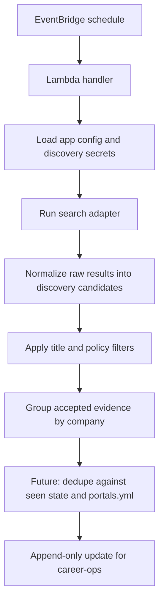

# job-discovery-system

`job-discovery-system` is a serverless discovery worker for `career-ops`. It runs on a schedule, searches for relevant job opportunities, filters low-signal results, groups evidence by company, and is being extended toward append-only writes into the shared `portals.yml` contract that `career-ops` already consumes.

The current tracked repository contains the runnable Lambda scaffold, the Exa-backed discovery prototype, characterization tests, deployment workflow, and IAM artifacts. Detailed private planning and vendor-note documents are intentionally kept local and are not part of the tracked remote history.

## System



## What This Is

- A Node.js and TypeScript AWS Lambda worker.
- A scheduled discovery layer that is meant to run without your laptop being online.
- A prototype pipeline that already supports smoke runs, typed runtime config, AWS Secrets Manager loading, Exa search retrieval, title filtering, company grouping, and Jest characterization coverage.
- A repository that is still missing the final append writer, GitHub Contents API write path, and seen-cache persistence.

## What This Is Not

- Not a full control plane or multi-tenant product.
- Not yet the complete append-to-`portals.yml` implementation.
- Not an application/evaluation system; `career-ops` still owns downstream scanning and decision-making.

## Repository Layout

- `src/handler/discover.ts`: Lambda entrypoint.
- `src/app/run-discovery.ts`: smoke mode and current discovery orchestration.
- `src/domain/filters/`: hard-filter logic.
- `src/domain/aggregation/`: grouping pipeline for accepted candidates.
- `src/sources/search/exa.ts`: Exa adapter and normalization.
- `test/`: characterization coverage for the current prototype path.
- `infra/`: IAM policy documents, trust policies, and SAM template.
- `.github/workflows/deploy-lambda.yml`: CI deploy workflow.

## Deploy

The supported deployment path is GitHub Actions plus AWS OIDC.

1. Create the GitHub OIDC identity provider in AWS for `https://token.actions.githubusercontent.com` if it does not already exist.
2. Create a GitHub Actions deploy role with:
   - trust policy: [infra/github-actions-oidc-trust-policy.json](/Users/arda/Desktop/development/job-discovery-system/infra/github-actions-oidc-trust-policy.json)
   - deploy policy: [infra/github-actions-deploy-policy.json](/Users/arda/Desktop/development/job-discovery-system/infra/github-actions-deploy-policy.json)
3. Create the Lambda execution role with:
   - trust policy: [infra/lambda-execution-trust-policy.json](/Users/arda/Desktop/development/job-discovery-system/infra/lambda-execution-trust-policy.json)
   - logging policy: [infra/lambda-execution-logging-policy.json](/Users/arda/Desktop/development/job-discovery-system/infra/lambda-execution-logging-policy.json)
   - secrets policy: [infra/lambda-execution-secrets-policy.json](/Users/arda/Desktop/development/job-discovery-system/infra/lambda-execution-secrets-policy.json)
4. Create the EventBridge Scheduler invoke role with:
   - trust policy: [infra/eventbridge-scheduler-trust-policy.json](/Users/arda/Desktop/development/job-discovery-system/infra/eventbridge-scheduler-trust-policy.json)
   - invoke policy: [infra/eventbridge-scheduler-invoke-policy.json](/Users/arda/Desktop/development/job-discovery-system/infra/eventbridge-scheduler-invoke-policy.json)
5. Set GitHub repository variables:
   - `AWS_REGION`
   - `LAMBDA_FUNCTION_NAME`
6. Set the GitHub repository secret:
   - `AWS_DEPLOY_ROLE_ARN`
7. Push to `main` or run the `Deploy Lambda` workflow manually.

The workflow will:

- install dependencies
- compile TypeScript
- prepare `build/lambda/`
- install production dependencies into the Lambda package
- zip `build/lambda.zip`
- update the target Lambda code and configuration

The workflow currently enforces:

- runtime: `nodejs24.x`
- handler: `handler/discover.handler`
- timeout: `5` seconds

Additional IAM setup details live in [infra/README.md](/Users/arda/Desktop/development/job-discovery-system/infra/README.md)

## Use

### Local setup

```bash
npm ci
npm run build
npm test
```

### Local smoke invocation

Smoke mode is the default and requires no discovery credentials:

```bash
node -e "const { handler } = require('./dist/handler/discover'); handler({}, { awsRequestId: 'local-smoke' }).then(console.log).catch((error) => { console.error(error); process.exit(1); });"
```

Expected response body:

```json
{"message":"ok","mode":"smoke"}
```

### Local discover invocation

Discover mode currently runs the Exa retrieval, normalization, title filter, and company-grouping path. It does not write to GitHub yet.

Set one of:

- `EXA_SECRET_ID` for AWS Secrets Manager-backed runs
- `EXA_API_KEY` for local bootstrap only

Optional runtime variables:

- `APP_ENV`: `dev` or `prod`
- `LOG_LEVEL`: `debug`, `info`, `warn`, or `error`

Example:

```bash
APP_ENV=dev LOG_LEVEL=info EXA_API_KEY=your-key-here npm run build
node -e "const { handler } = require('./dist/handler/discover'); handler({ mode: 'discover' }, { awsRequestId: 'local-discover' }).then(console.log).catch((error) => { console.error(error); process.exit(1); });"
```

You can also override the current prototype search and title filter inputs per invocation:

```json
{
  "mode": "discover",
  "exaSearch": {
    "query": "site:jobs.lever.co platform engineer remote typescript",
    "numResults": 5
  },
  "titleFilter": {
    "include": ["platform", "backend", "typescript"],
    "exclude": ["senior manager", "designer"]
  }
}
```

### Deployed usage

After deployment, invoke the Lambda with one of these payloads:

- smoke:

```json
{}
```

- discover:

```json
{
  "mode": "discover"
}
```

The deployed function is intended to be triggered on a schedule through EventBridge Scheduler once the target Lambda and invoke role are wired.

## Current Status

- Working today: smoke path, typed config loading, Secrets Manager integration, Exa search adapter, title filtering, company grouping, characterization tests, GitHub Actions deploy workflow.
- Still to implement: append-safe `portals.yml` writer, GitHub Contents API merge-on-write flow, seen-cache persistence, broader source adapters, and final deterministic write path.
